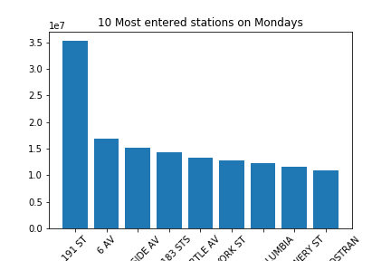

# How Exploratory Data Analysis can help in finding your audience

Suppose you, one of NYC's talented musicians, would like to find out where you could perform your music for the largest crowd. Well, you could go to Time Square,
but you would likely be drowned out by all the tourist attractions and novelty stores. Instead, hit up a subway station. That way, the people waiting for their
train can listen to your music until their commute can continue. Knowing this, we may not want to include people who are leaving the stations, as they would leave
without hearing what you have to play.

A problem you may run into is that you may only be available on specific days, and you may not know which station is most populated on those days. Suppose you're only
available on Mondays -- we can analyze some data and inform you that the 191 ST station is the most populated on average on Mondays. But in order to give you options,
we can also provide the rest of the top 10 stations most populated by people waiting for their train and willing to listen to your performance.

